Predictive Modeling Part II: Case Studies
================
Rachel Meade, Ian Hatfield, Curtis Krawczyk, LaShay Fontenot
8/19/2019

\#STA 380: Predictive Modeling II Case Studies

## By: Rachel Meade, Ian Hatfield, Curtis Krawczyk, LaShay Fontenot

## Green Buildings

Real estate investors and developers invest in green buildings, whether
they are LEED- or EnergyStar-certified with the hopes of being able to
generate additional revenues in rent, or (in cases in which utilities
are not reimbursed by tenants) to save enough money in utilities to
effectively generate higher profits by reducing utility expenses.
Although these hopes may be realized in individual cases, there is not
enough support in the Green Buildings dataset to conclude that investing
in a Green Building will typically generate higher rents or utilities
savings. In fact, based on some simple analysis, it appears that some
green buildings may even generate lower rents than similar non-green
buildings.

The previous analysis provided in the case study was flawed because it
looked only at green versus non-green buildings in aggregate. It
concluded that green buildings generated higher rents by comparing
median price per square foot of green and non-green buildings. This
analysis does not look at many other potential hidden variables that
could account for the difference in price, other than green
vs. non-green.

The graph below demonstrates that proportionally more green buildings
are Class A than non-green buildings.

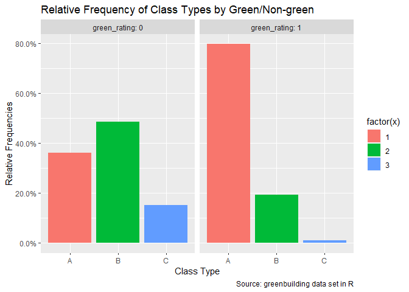<!-- --> The percentage
of Class A green buildings is \~79.8%.

The percentage of Class A non-green buildings is \~37%.

The percentage of Class B green buildings is \~19.15%.

The percentage of Class B non-green buildings is \~48.5%.

The percentage of Class C green buildings is \~1%.

The percentage of Class C non-green buildings is \~14.5%.

Green buildings could generate higher rents overall not because they are
green, but because they are nicer buildings, on average. This analysis
suggests that green buildings could generate higher rents on average
because they are more likely to be Class A Buildings.

When the effects of building class and green vs. non-green are
separated, the conclusion that green buildings generate higher rents is
unsupported.

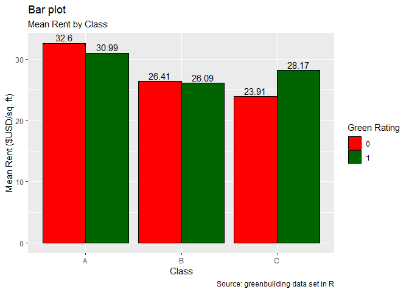<!-- --> The above
graph demonstrates that when separated by class, only Class C green
buildings generate higher rents than their non-green counterparts. This
supports the conclusion that the effect captured in the previous report
was actually related to having nicer buildings on average in the green
population, compared to the non-green population.

A multiple regression provides additional evidence to further separate
the effects of Building Class and Green status. As demonstrated by the
coefficients below, a Class A generates the greatest rent premiums,
followed by Class B buildings. Green buildings actually have a negative
relationship to price (although the statistical significance is less
certain than building class). This would suggest that green buildings
typically have lower rents than their non-green peers.

    ## 
    ## Call:
    ## lm(formula = Rent ~ class_a + class_b + green_rating, data = green)
    ## 
    ## Residuals:
    ##     Min      1Q  Median      3Q     Max 
    ## -23.536  -8.947  -2.663   5.559 217.464 
    ## 
    ## Coefficients:
    ##              Estimate Std. Error t value Pr(>|t|)    
    ## (Intercept)   23.9471     0.4416  54.228  < 2e-16 ***
    ## class_a        8.5888     0.5233  16.413  < 2e-16 ***
    ## class_b        2.4936     0.5050   4.938 8.06e-07 ***
    ## green_rating  -1.2576     0.6079  -2.069   0.0386 *  
    ## ---
    ## Signif. codes:  0 '***' 0.001 '**' 0.01 '*' 0.05 '.' 0.1 ' ' 1
    ## 
    ## Residual standard error: 14.71 on 7890 degrees of freedom
    ## Multiple R-squared:  0.04798,    Adjusted R-squared:  0.04762 
    ## F-statistic: 132.5 on 3 and 7890 DF,  p-value: < 2.2e-16

This still leaves the question of lower utility expense. Based on a
little external research, a typical office building utilizes about 17.3
kilowatt hours per square foot per year. At 2.9 cents per kilowatt hour,
this is about 50 cents per square foot per year. Even if there was a 50%
savings in electricity expenses, this would not outweigh the
approximately two dollar difference in rent for Class A green
vs. non-green buildings. Gas expense savings were similarly negligible.

In conclusion, although there may still be moral and reputational
benefits to investing in green properties, there is insufficient
evidence to conclude that green buildings will result in better
financial investment returns. Instead of investing in green
certification, the developer may realize better returns by upgrading the
building’s class (e.g. from a Class B to a Class A building).

\#Fligths at Austin-Bergstrom Airport

The below plots are created by first subsetting the dataset to focus on
flights departing from the Austin airport. These destinations are then
plotted on a map of the US with the size of the marker reflecting the
amount of flights to that location. Markers are then colored based on
the average delay time of flights to those locations on a blue/red
scale. This final plot could be helpful for Austinites that travel
frequently and are curious about flight patterns for their destination.

``` r
#Plot USA map
usa_bb = c(-124.848974, 24.396308, -66.885444, 49.384358)
usa_map = ggmap(get_stamenmap(bbox=usa_bb, scale=2, zoom=5,
                              maptype = "terrain"), extent="normal")
```

    ## Source : http://tile.stamen.com/terrain/5/4/10.png

    ## Source : http://tile.stamen.com/terrain/5/5/10.png

    ## Source : http://tile.stamen.com/terrain/5/6/10.png

    ## Source : http://tile.stamen.com/terrain/5/7/10.png

    ## Source : http://tile.stamen.com/terrain/5/8/10.png

    ## Source : http://tile.stamen.com/terrain/5/9/10.png

    ## Source : http://tile.stamen.com/terrain/5/10/10.png

    ## Source : http://tile.stamen.com/terrain/5/4/11.png

    ## Source : http://tile.stamen.com/terrain/5/5/11.png

    ## Source : http://tile.stamen.com/terrain/5/6/11.png

    ## Source : http://tile.stamen.com/terrain/5/7/11.png

    ## Source : http://tile.stamen.com/terrain/5/8/11.png

    ## Source : http://tile.stamen.com/terrain/5/9/11.png

    ## Source : http://tile.stamen.com/terrain/5/10/11.png

    ## Source : http://tile.stamen.com/terrain/5/4/12.png

    ## Source : http://tile.stamen.com/terrain/5/5/12.png

    ## Source : http://tile.stamen.com/terrain/5/6/12.png

    ## Source : http://tile.stamen.com/terrain/5/7/12.png

    ## Source : http://tile.stamen.com/terrain/5/8/12.png

    ## Source : http://tile.stamen.com/terrain/5/9/12.png

    ## Source : http://tile.stamen.com/terrain/5/10/12.png

    ## Source : http://tile.stamen.com/terrain/5/4/13.png

    ## Source : http://tile.stamen.com/terrain/5/5/13.png

    ## Source : http://tile.stamen.com/terrain/5/6/13.png

    ## Source : http://tile.stamen.com/terrain/5/7/13.png

    ## Source : http://tile.stamen.com/terrain/5/8/13.png

    ## Source : http://tile.stamen.com/terrain/5/9/13.png

    ## Source : http://tile.stamen.com/terrain/5/10/13.png

``` r
#Layer AUS destinations with size as number of flights
#scale down circle sizes to fit on map
circle_scale_amt = 0.0035
#plot
usa_map + 
  geom_point(aes(x = dest_long, y = dest_lat),data=grouped, 
                          col= "orange",alpha=.6,size = grouped$count*circle_scale_amt)+
               scale_size_continuous(range=c(1,5573))
```

    ## Warning in min(x): no non-missing arguments to min; returning Inf

    ## Warning in max(x): no non-missing arguments to max; returning -Inf

<!-- -->

``` r
#get delays
grouped2 = summarize(group_by(aus,Dest,dest_long,dest_lat), count= n(),
                     delay = mean(ArrDelay, na.rm = T))
grouped2$count = as.numeric(grouped2$count)
grouped2$dest_long = as.numeric(as.character(grouped2$dest_long))
grouped2$dest_lat = as.numeric(as.character(grouped2$dest_lat))

#scale delay so that all positive values (for graphing purposes)
grouped2$scdelay = as.numeric(rescale(grouped2$delay))
grouped2 = grouped2[-39,]

#build plot, where darker = higher avg delays
usa_map + 
  geom_point(aes(x = dest_long, y = dest_lat,col= grouped2$scdelay),data=grouped2, 
             alpha=.6,size = grouped2$count*circle_scale_amt)+
  scale_size_continuous(range=c(1,5573))+
  scale_color_gradient(low="blue",high="red",limits=c(0,.25)) +
  labs(title = "Flights and Delays out of AUS", 
       subtitle = "Flights out of AUS to US destinations, where the size reflects
       the # of flights, and the color reflects the mean delay",
       x= "Longitude",y="Latitude",colour="Mean Delay (scaled)")
```

    ## Warning in min(x): no non-missing arguments to min; returning Inf

    ## Warning in max(x): no non-missing arguments to max; returning -Inf

<!-- -->

In summary we see that flights from AUS to ATL are typically delayed
longer than flights to other locations. On the other hand, flights to
Miami are great (for more than one reason, I’d say). These results are
not incredibly surprising because ATL is a huge airport hosting
thousands of flights, and is more susceptible to regular and weather
delays than Miami. In addition, it is not surprising that a majority of
flights out of AUS are to Dallas and Houston - I would assume that this
is largely due to business travel.

# Portfolio Modeling

We will construct four portfolios of exchange-traded funds (ETFs) and
use bootstrap resampling to analyze the short-term tail risk of these
portfolios.

We will assume we have $100,000 in capital. We will construct portfolios
using between 3 and 10 ETFs, with different weights.

We will assume that the portfolios are rebalanced each day at zero
transaction cost.

First, we prepare to run the Monte Carlo simulations by calling the
necessary libraries, defining the ETFs we will use to build each
portfolio, and import 5 years of historical returns that we will draw
from in the simulations.

Adjust all ETFs and create a new object adding ‘a’ to the end.

Combine all the returns in a matrix.

Compute the returns from the closing prices
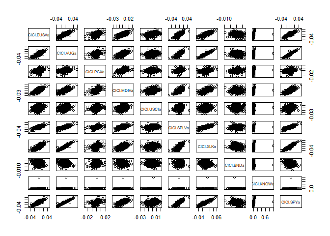<!-- --> Run the Monte
Carlo simulations to demonstrate many different possible scenarios.

Histogram of the ending wealth amounts generated by the simulations.
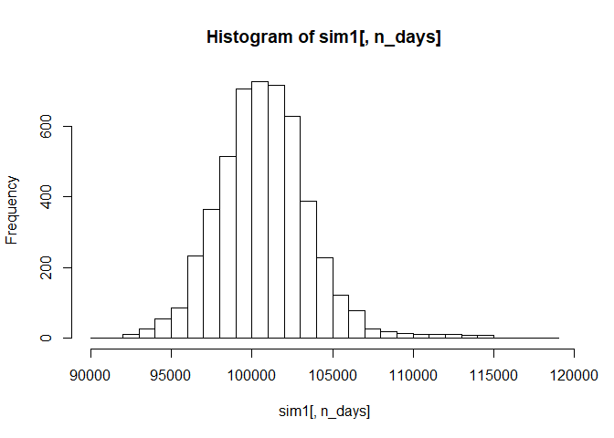<!-- --> Profit/loss

    ## [1] 100753.1

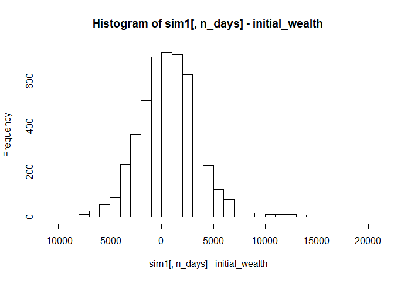<!-- --> Calculate
Value at Risk at the 5% level.

    ##        5% 
    ## -3657.733

We repeat the above process twice more with different portfolios. Since
we are using a subset of the same ETFs as the first example, we will
just adjust the weights of each ETF and re-run the simulations.

``` 
```

This portfolio focuses on the Tech Sector (30% weight on XLK -
Technology Select Secotr SPDR Fund) and drop COmmodity Index Fund (USCI)
& Bonds (BND).

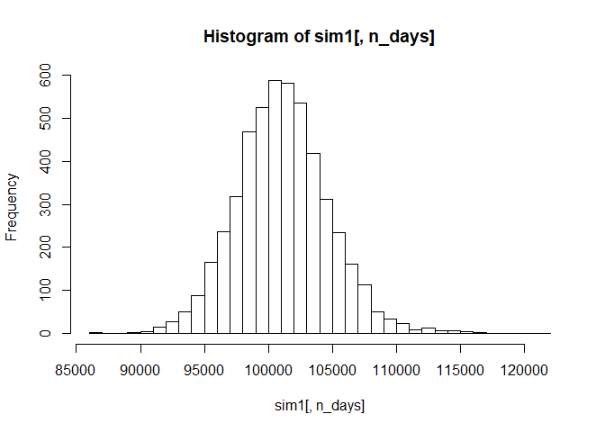<!-- --> Profit/loss

    ## [1] 101079.4

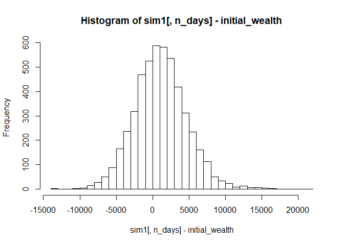<!-- --> 5% Value at
Risk

    ##        5% 
    ## -4952.809

Change weights to focus on Bonds, & Commodity Index and drop EUSA, VUG,
SPY, XLK, and PGX
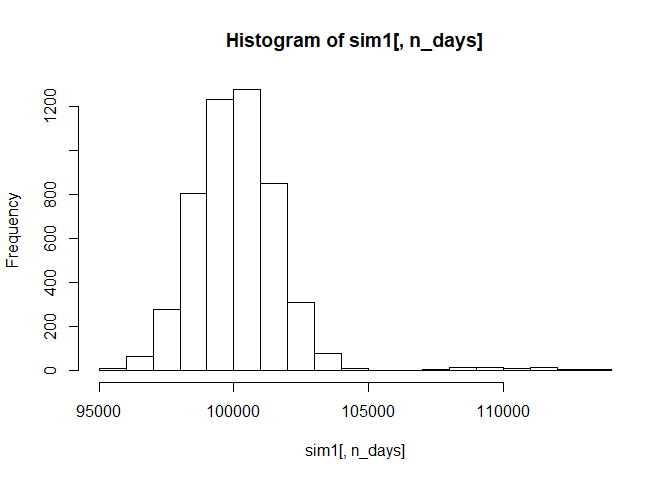<!-- --> Profit/loss

    ## [1] 100238

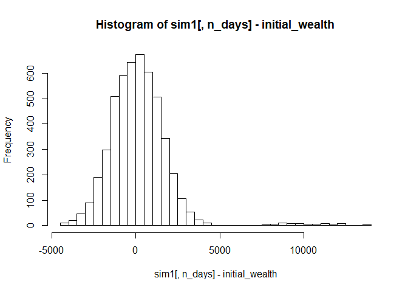<!-- --> 5% Value at
Risk

    ##        5% 
    ## -2194.651

Finally, we try to make a poorly diversified portfolio, leaving only
Commodities, Tech, and Insider Sentiment.
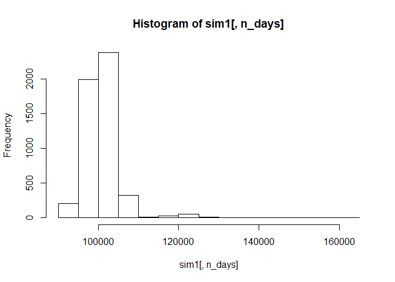<!-- --> Profit/loss

    ## [1] 100663.1

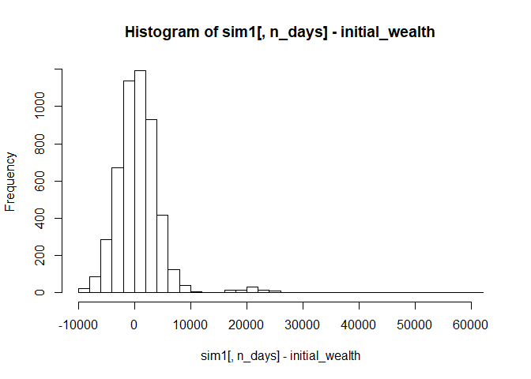<!-- --> 5% Value at
Risk

    ##       5% 
    ## -4933.37

The first portfolio is the most diversified, which would suggest that it
would have a better sharpe ratio than some of the other portfolios we
constructed. We would expect it to have good returns compared to the
amount of value at risk. After running the Monte Carlo simulations, the
outcome matched expectations.

The second portfolio is more aggressive. It emphasizes the technology
sector, but it is still fairly diversified. Because it retains some
diversification and emphasizes an industry that has been strong in the
past few years, we would expect slightly higher returns than the highly
diverse portfolio above, but at the expense of greater value at risk.
Again, the simulations confirmed our expectations.

The third portfolio was intended to be low risk. 70% of the wealth is
invested in bonds and commodities, and includes smaller amounts of
preffered equities, the low volatility S\&P index, and insider
sentiment. As expected, this portfolio generated the lowest returns on
average, and had the lowest value at risk.

Finally, we attempted to construct a portfolio that was poorly
diversified, and therefore higher risk. It invests 40% in Commodities,
40% in Tech, and the remaining 20% in Insider Sentiment. As suspected,
it had the highest value at risk, but surprisingly, it was only slightly
higher than the technology portfolio. On average, it generated lower
returns than the technology portfolio. Therefore, as suspected, this
portfolio would likely be a poor investment choice.

It is important to note, however, that all of these results could be
impacted by only using the past five years’ history to draw from in the
Monte Carlo simulations. In the past five years (2014-2019), the market
has generally been bullish and market returns have been generally
positive. With uncertainty in the market growing and rumors of an
impending recession, the past five years of returns are not necessarily
indicative of the most probable future outcomes.

\#Market Segmentation

``` r
rm(list=ls())
df <- read.csv(file=".\\data\\social_marketing.csv", header=TRUE, sep=",")
library(ggplot2)
library(dplyr)
library(purrr)
library(factoextra)
```

    ## Warning: package 'factoextra' was built under R version 3.6.1

    ## Welcome! Related Books: `Practical Guide To Cluster Analysis in R` at https://goo.gl/13EFCZ

``` r
df=df[,-1]
```

In order to use k-means clustering on the twitter followers a value of k
needs to be chosen. The elbow plot below is somewhat ambiguous as to
where the elbow is, but a value of 7 was chosen for k.

    ## Warning: did not converge in 10 iterations

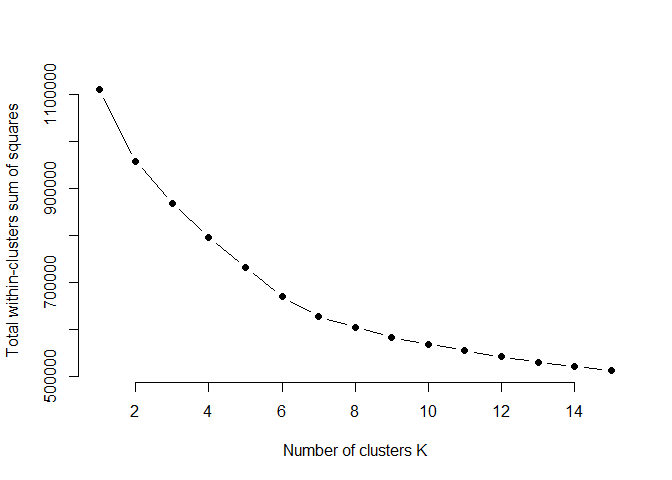<!-- -->

    ## # A tibble: 7 x 37
    ##   Cluster chatter current_events travel photo_sharing uncategorized tv_film
    ##     <int>   <dbl>          <dbl>  <dbl>         <dbl>         <dbl>   <dbl>
    ## 1       1    4.06           1.68   6.50          2.26         0.731    1.17
    ## 2       2    4.00           1.72   1.46          6.01         1.21     1.01
    ## 3       3    3.53           1.64   1.21          2.09         0.720    1.02
    ## 4       4    4.04           1.54   1.32          2.43         0.960    1.04
    ## 5       5    4.11           1.43   1.52          2.65         0.846    1.44
    ## 6       6    2.93           1.36   1.12          1.51         0.718    1.04
    ## 7       7   10.00           1.85   1.20          5.68         0.902    1.06
    ## # ... with 30 more variables: sports_fandom <dbl>, politics <dbl>,
    ## #   food <dbl>, family <dbl>, home_and_garden <dbl>, music <dbl>,
    ## #   news <dbl>, online_gaming <dbl>, shopping <dbl>,
    ## #   health_nutrition <dbl>, college_uni <dbl>, sports_playing <dbl>,
    ## #   cooking <dbl>, eco <dbl>, computers <dbl>, business <dbl>,
    ## #   outdoors <dbl>, crafts <dbl>, automotive <dbl>, art <dbl>,
    ## #   religion <dbl>, beauty <dbl>, parenting <dbl>, dating <dbl>,
    ## #   school <dbl>, personal_fitness <dbl>, fashion <dbl>,
    ## #   small_business <dbl>, spam <dbl>, adult <dbl>

**Below we will examine the 7 customer segments that were identified
using k-means clustering:**

**Customer segment 1, Politics:**  
Looking at the mean values of customer segment 1 the categories that
stand out are Travel, Politics, and News. These categories depict a
customer base of individuals who follow world events and travel.

**Customer segment 2, Fashion:**  
Looking at the mean values of customer segment 2 the categories that
stand out are Photo Sharing, Music, Cooking, Beauty, and Fashion. These
categories depict a customer base of individuals interested in
fashion/beauty.

**Customer segment 3, Family:**  
Looking at the mean values of customer segment 3 the categories that
stand out are Sports Fandom, Food, Religion, Family and Parenting. These
categories depict a customer base of parents and family oriented
individuals.

**Customer segment 4, Health Conscious:**  
Looking at the mean values of customer segment 4 the categories that
stand out are Food, Health, Cooking, Outdoors, and Fitness. These
categories depict a customer base of health conscious individuals.

**Customer segment 5, College Students/Young Adults:**  
Looking at the mean values of customer segment 5 the categories that
stand out are tv/Film, online gaming, College/Uni, and Sports Playing.
These categories depict a customer base of college students/young
adults.

**Customer segment 6, N/A:**  
Looking at the mean values of customer segment 6 no categories standout.
This is a very uninterpretable customer segment and it is possible that
this segment is a collection of customers from many segments. For every
value of K, there was an uninterpretable segment.

**Customer segment 7, Pop Culture:**  
Looking at the mean values of customer segment 7 the categories that
stand out are Chatter, Current Events, Photo Sharing, and Shopping.
These categories depict a customer base of pop culture influenced
individuals.

\#Author Attribution

To start the analysis of author attribution we created readerPlain, this
wraps another function around readPlain to read plain text documents in
English. Using readerPlain, the train .txt files and test .txt files are
read in and stored in corresponding large lists. Making the large lists
vectors, two separate corpora are made, one for train and one for test.
Next is pre-processing, the pre-processing/tokenization steps are as
follows, make everything lower case, remove numbers, remove punctuation,
remove excess white-space, and remove stop words, ‘en’. Having processed
both corpus’, document term matrices were created and words that
appeared in \<90% of documents were removed. Using the DTMs, TFIDF
matrices were created and saved as train and test. The TFIDF matrices
were converted to data frames and an empty author column was created,
the author column was then populated using a for loop that assigned a
unique author id to each document. The author columns were then changed
to be type ‘factor’. At this point, the pre-model processing has been
completed and we now will prepare the data for a naive bayes model. A X
train matrix and X test matrix were created using all predictors from
the corresponding matrices and a y train and Y test list were created
from the author columns of the corresponding matrices. There are columns
in X train that do not appear in X test, these columns were ignored. A
naive bayes model was then fit using X train and the model was used to
predict X test. The results were then put into a confusion matrix where
the accuracy of the model was seen to be
    36%.

    ## Warning: predict.naive_bayes(): Only 742 feature(s) out of 801 defined in the naive_bayes object "naive.fit" are used for prediction.

    ## Warning: predict.naive_bayes(): More features in the newdata are provided
    ## as there are probability tables in the object. Calculation is performed
    ## based on features to be found in the tables.

    ## Confusion Matrix and Statistics
    ## 
    ##              Y_Test
    ## naive_predict  1  2  3  4  5  6  7  8  9 10 11 12 13 14 15 16 17 18 19 20
    ##            1  24  0  0  0  1  0  0  0  0  0  0  0  0  0  0  0  0  0  0  0
    ##            2   0  9  0  0  0  0  0  0  0  0  0  0  0  0  1  0  0  1  0  0
    ##            3   1  0 26  0  6  0  2  0  8  0  1  0  1  0  0  1  4  1  4 11
    ##            4   0  0  0  2  0  0  0  0  0  0  0  0  2  7  0  0  0  1  0  0
    ##            5   0  0  0  0 15  0  0  0  0  0  0  0  0  0  1  0  2  0  0  0
    ##            6   1  1  0  0  0 26  2  6  0  2  0  0  0  0  0  0  0  1  0  0
    ##            7   0  0  1  0  7  0  4  2  0  1  2  0  3  0  0  0  1  0  0  0
    ##            8   0  0  0  0  0  0  0  3  0  0  0  0  0  0  0  0  0  0  0  0
    ##            9   0  0  0  0  0  1  0  1 12  0  0  0  0  0  1  0  1  1  2  0
    ##            10  1  0  0  0  0  0  0  0  0 27  1  0  0  0  0  0  0  0  0  0
    ##            11  1  0  0  0  0  0  0  0  0  0 35  0  0  0  0  0  0  0  0  0
    ##            12  0  7  0  3  1  0  0  0  0  0  1 23  0  0  1  0  0  1  0  0
    ##            13  0  1  0  0  0  1  7  0  0  0  0  0 10  0  0  0  0  0  0  0
    ##            14  0  4  0 12  0  0  2  1  0  1  0  4  4 11  2  2  0  2  0  0
    ##            15  0  9  0  0  0  0  0  0  0  0  0  0  2  0 13  0  0  4  0  0
    ##            16  0  0  0  0  1  0  0  0  0  0  0  0  0  0  1 24  0  0  0  0
    ##            17  1  2 11  0  1  0  3  1  2  0  1  0  1  0  3  1 22  0  3  2
    ##            18  0  1  0  0  0  0  0  0  0  0  0  0  1  0  2  0  0 12  0  0
    ##            19  0  1  1  0  1  0  0  0  1  0  0  0  0  0  0  1  0  0 18  5
    ##            20  0  0  0  0  0  0  0  0  2  0  0  0  0  0  0  0  1  0  0 21
    ##            21  3  0  0  2  0  0  3  0  0  0  0  0  3  0  3  0  0  2  0  0
    ##            22  0  0  0  0  2  0  2  0  1  2  0  0  0  0  0  0  0  1  2  0
    ##            23  0  0  0  0  0  5  0  3  0  1  0  0  2  0  0  0  0  0  0  0
    ##            24  0  1  1  0  1  0  2  0  2  0  0  0  1  0  0  1  2  0  1  0
    ##            25  1  3  1  0  2  1  1  0  4  2  0  0  0  0  1  4  5  0  5  1
    ##            26  0  0  0  0  0  0  0  2  0  0  0  0  0  0  0  0  0  0  0  0
    ##            27  1  0  0  0  0  0  2  1  0  0  0  0  0  0  0  0  0  0  0  0
    ##            28  0  0  0  0  0  0  0  0  0  0  0  0  1  1  0  0  0  0  0  0
    ##            29  0  6  0  0  2  0  0  0  0  0  1  0  3  0  5  0  0  0  0  0
    ##            30  0  0  0  0  0  0  0  0  0  0  1  0  0  0  0  0  0  0  0  0
    ##            31  0  0  0  0  3  0  1  0  3  0  1  0  0  0  0  0  2  0  1  0
    ##            32  0  0  0  0  0  3  0  2  0  2  0  0  0  0  1  0  0  0  2  0
    ##            33  1  1  0  0  0  0  0  0  2  0  0  1  0  0  1  1  0  0  1  0
    ##            34  1  0  0  0  0  0  0  0  1  0  0  0  1  0  2  1  0  0  0  0
    ##            35  0  0  0  7  0  0  0  0  0  0  0  1  5  7  0  2  0  4  0  0
    ##            36  1  0  0  0  0  1  2  1  0  3  0  0  0  0  0  0  0  0  0  0
    ##            37  2  0  0  0  0  3  5  9  0  0  1  0  0  0  0  0  0  0  0  0
    ##            38  1  0  0  3  0  0  0  0  0  0  0  1  0  2  0  0  0  0  0  0
    ##            39  2  0  0  0  1  0  0  1  0  0  1  0  0  0  1  2  0  2  0  1
    ##            40  0  0  0  0  0  1  0  3  0  0  0  0  0  0  0  0  0  0  0  0
    ##            41  0  0  0  0  0  0  0  0  4  1  0  0  0  0  0  0  0  0  0  0
    ##            42  1  0  1  0  0  1  5  2  0  6  1  0  1  0  0  1  0  0  0  1
    ##            43  4  4  0  0  5  0  5  0  1  0  1 11  1  2  2  5  1  2  1  0
    ##            44  0  0  0 12  0  0  0  1  0  0  0  3  2 13  6  0  0  9  0  0
    ##            45  0  0  8  0  0  1  0  0  4  0  0  0  1  0  0  0  9  0  6  1
    ##            46  1  0  0  3  0  0  0  0  0  0  0  0  1  2  0  3  0  1  0  0
    ##            47  0  0  0  0  0  4  0  0  0  1  0  0  0  0  0  0  0  0  0  0
    ##            48  0  0  0  0  1  0  0  1  3  0  0  0  2  0  0  1  0  1  4  7
    ##            49  1  0  0  0  0  2  2 10  0  1  0  0  0  0  0  0  0  0  0  0
    ##            50  1  0  0  6  0  0  0  0  0  0  2  6  2  5  3  0  0  4  0  0
    ##              Y_Test
    ## naive_predict 21 22 23 24 25 26 27 28 29 30 31 32 33 34 35 36 37 38 39 40
    ##            1   0  0  1  2  1  0  0  0  0  0  0  0  0  0  0  0  0  0  0  0
    ##            2   0  0  0  0  0  0  0  0  0  0  1  0  0  0  0  0  0  0  0  0
    ##            3   3  5  1  3  7  0  0  0  0  0  2  0  0  1  0  0  1  0  3  2
    ##            4   0  0  0  0  0  0  0  0  0  0  0  0  0  0  2  0  0  0  0  0
    ##            5   0  2  0  3  0  0  0  0  0  0  1  0  0  1  0  0  0  0  2  0
    ##            6   0  0  8  2  0  2  1  0  0  1  0  6  0  1  1  2  4  0  0  4
    ##            7   0  0  2  2  0  2  7  0  0  1  1  0  0  0  0  0  0  0  0  1
    ##            8   0  0  0  0  0  0  0  0  0  0  0  0  0  0  0  0  0  0  0  0
    ##            9   0  1  0  0  0  0  0  0  0  1  0  0  0  0  0  0  0  0  0  0
    ##            10  0  0  1  0  0  9  3  0  0  0  0  7  0  2  0  5  0  0  1  2
    ##            11  0  0  0  1  0  0  1  0  2  0  1  0  0  0  0  0  0  0  2  0
    ##            12  0  0  0  0  0  0  0  2  1  0  0  0  0  0  0  0  0  0  0  0
    ##            13  1  0  0  1  0  0  1  1  0  0  0  0  0  3  0  0  0  0  0  0
    ##            14 11  0  0  0  0  0  0  3  1  0  1  2  3  0 17  0  0  4  1  0
    ##            15  1  0  0  0  0  0  0  0  0  0  2  0  0  0  1  0  0  0  0  0
    ##            16  0  0  0  0  0  0  0  0  0  0  0  0  0  0  0  0  0  0  0  0
    ##            17  1  3  0  0  0  0  0  0  1  3  1  0  2  4  0  0  0  0  4  0
    ##            18  0  0  0  0  0  0  1  0  0  2  0  0  1  0  0  0  0  0  0  0
    ##            19  0  1  0  0  0  0  0  0  0  2  0  1  0  0  0  0  0  0  1  0
    ##            20  0  6  0  0  3  0  0  0  0  0  0  0  0  0  0  0  2  0  0  1
    ##            21 16  0  0  0  0  0  0  0  0  0  0  0  0  0  0  1  0  0  0  0
    ##            22  0 20  0  1  4  0  0  0  0  3  1  1  0  1  0  1  1  0  0  0
    ##            23  0  0 13  1  1  2  1  0  1  0  1  2  0  3  0  0  8  0  0  1
    ##            24  0  0  0 12  0  0  1  0  0  0  6  0  0  0  0  0  0  0  3  1
    ##            25  0  4  1  3 25  1  1  0  0  2  0  0  0  1  0  4  3  0  1  5
    ##            26  0  0  0  0  0 13  0  0  0  0  0  1  0  0  0  0  3  0  0  0
    ##            27  0  0  0  0  0  0 26  0  0  0  0  0  0  0  0  0  0  0  0  0
    ##            28  0  0  0  1  0  0  0 32  0  0  0  0  1  0  1  0  0  0  0  0
    ##            29  2  0  0  0  0  0  0  0 34  0  2  0  5  0  1  0  0  0  1  1
    ##            30  0  0  0  0  0  0  0  0  0 19  0  0  0  2  0  1  0  0 11  0
    ##            31  0  0  0  2  0  0  0  0  2  1 16  0  1  1  0  0  0  0  0  0
    ##            32  0  0  4  0  0  4  2  0  0  1  0 13  0  1  0  1  1  0  0  0
    ##            33  2  0  0  2  0  0  0  0  1  0  0  0 33  0  0  0  0  0  1  0
    ##            34  0  0  0  1  0  1  1  0  0  1  4  0  0 18  0  0  3  0  0  0
    ##            35  2  0  0  0  0  0  0  1  0  2  2  0  1  0  6  0  0  4  0  0
    ##            36  0  2  3  1  2  0  0  0  0  0  1  2  0  1  0 25  1  0  0  0
    ##            37  0  0  3  0  0  2  0  1  0  0  0  5  0  1  0  0 15  0  1  7
    ##            38  2  0  0  0  0  0  0  0  0  0  0  0  0  0  3  0  0 14  0  0
    ##            39  0  0  0  0  3  0  0  0  2  7  1  0  0  0  0  0  0  0 14  0
    ##            40  0  0  1  0  0  0  0  0  0  0  0  0  0  1  0  0  1  0  0 21
    ##            41  0  0  0  0  0  0  0  0  0  0  0  0  0  1  0  0  0  0  0  0
    ##            42  0  0  6  1  2  4  1  0  0  2  0  7  0  3  0  5  2  0  1  0
    ##            43  1  2  1  1  0  0  1  6  1  0  4  0  0  0  0  0  0  9  1  0
    ##            44  6  0  0  3  0  0  0  1  3  0  0  0  1  1  7  0  0  5  0  0
    ##            45  0  3  1  1  1  0  0  0  0  0  1  0  0  1  0  0  1  0  0  1
    ##            46  1  0  0  0  0  0  0  3  0  0  0  0  1  0  5  0  0 13  0  1
    ##            47  0  0  3  0  0 10  1  0  0  1  0  2  0  0  0  5  4  0  0  0
    ##            48  0  1  0  4  1  0  0  0  0  0  0  0  0  0  0  0  0  0  2  0
    ##            49  0  0  1  0  0  0  1  0  0  0  1  1  0  0  0  0  0  0  0  2
    ##            50  1  0  0  2  0  0  0  0  1  1  0  0  1  2  6  0  0  1  0  0
    ##              Y_Test
    ## naive_predict 41 42 43 44 45 46 47 48 49 50
    ##            1   4  0  0  0  0  0  1  1  2  0
    ##            2   0  0  0  0  1  0  0  0  0  0
    ##            3   5  2  1  0 16  2  1  3  1  0
    ##            4   0  0  1  1  0  0  0  0  0  3
    ##            5   0  0  0  0  0  0  0  3  0  0
    ##            6   0  2  0  0  0  0  2  0  1  0
    ##            7   0  0  0  0  0  0  0  1  2  0
    ##            8   0  0  0  0  0  0  0  0  7  0
    ##            9   0  0  0  0  0  0  0  2  0  0
    ##            10  0  5  0  0  0  0 11  0  0  0
    ##            11  0  0  0  0  0  0  0  0  0  1
    ##            12  0  0  2  3  0  0  0  0  0  0
    ##            13  0  0  0  0  0  0  0  0  2  0
    ##            14  3  0  4 16  0  3  0  0  0  7
    ##            15  0  0  0  0  0  0  0  0  0  0
    ##            16  0  0  1  0  0  0  0  2  0  0
    ##            17  0  0  0  0  5  0  0  0  0  0
    ##            18  0  0  0  0  0  0  0  0  0  0
    ##            19  0  0  0  0  0  0  0  6  0  0
    ##            20  0  0  0  0  0  0  0  1  0  0
    ##            21  0  0  0  1  0  0  0  0  3  0
    ##            22  0  0  0  0  0  0  0  0  0  0
    ##            23  0  1  0  0  0  0  2  0  1  0
    ##            24  0  0  0  0  0  1  0  3  0  0
    ##            25  1  4  0  0  0  1  0  2  1  0
    ##            26  0  1  0  0  0  0  1  0  0  0
    ##            27  0  0  0  0  0  0  0  0  0  0
    ##            28  0  0  0  1  0  0  0  0  0  1
    ##            29  0  0  0  0  1  0  0  0  1  0
    ##            30  0  0  0  0  0  0  0  0  0  0
    ##            31  0  0  0  0  0  0  0  1  0  0
    ##            32  0  3  0  0  0  0  1  0  2  0
    ##            33  0  0  0  0  0  0  0  0  0  0
    ##            34  3  0  0  0  0  0  1  0  1  0
    ##            35  0  0  2  6  0  4  1  0  0  5
    ##            36  5  0  0  0  0  0  1  0  0  0
    ##            37  0  0  0  0  0  0  0  0  3  0
    ##            38  2  0  6  2  0  7  0  0  0  0
    ##            39  0  0  0  0  0  0  0  1  0  0
    ##            40  0  0  0  0  0  0  0  0  0  0
    ##            41 18  0  0  0  0  0  2  0  0  0
    ##            42  0 23  0  0  0  0 12  0  5  0
    ##            43  1  0 26  0  0 11  0  1  0  4
    ##            44  2  0  1 10  0  3  0  0  3 11
    ##            45  0  0  1  0 24  0  0  5  0  0
    ##            46  0  1  4  7  2 18  0  1  0  2
    ##            47  0  7  0  0  0  0 14  0  1  0
    ##            48  0  0  0  0  1  0  0 17  1  0
    ##            49  0  1  0  0  0  0  0  0 13  0
    ##            50  6  0  1  3  0  0  0  0  0 16
    ## 
    ## Overall Statistics
    ##                                           
    ##                Accuracy : 0.3604          
    ##                  95% CI : (0.3416, 0.3796)
    ##     No Information Rate : 0.02            
    ##     P-Value [Acc > NIR] : < 2.2e-16       
    ##                                           
    ##                   Kappa : 0.3473          
    ##                                           
    ##  Mcnemar's Test P-Value : NA              
    ## 
    ## Statistics by Class:
    ## 
    ##                      Class: 1 Class: 2 Class: 3 Class: 4 Class: 5 Class: 6
    ## Sensitivity            0.4800   0.1800   0.5200   0.0400   0.3000   0.5200
    ## Specificity            0.9947   0.9984   0.9596   0.9931   0.9939   0.9796
    ## Pos Pred Value         0.6486   0.6923   0.2080   0.1053   0.5000   0.3421
    ## Neg Pred Value         0.9894   0.9835   0.9899   0.9807   0.9858   0.9901
    ## Prevalence             0.0200   0.0200   0.0200   0.0200   0.0200   0.0200
    ## Detection Rate         0.0096   0.0036   0.0104   0.0008   0.0060   0.0104
    ## Detection Prevalence   0.0148   0.0052   0.0500   0.0076   0.0120   0.0304
    ## Balanced Accuracy      0.7373   0.5892   0.7398   0.5165   0.6469   0.7498
    ##                      Class: 7 Class: 8 Class: 9 Class: 10 Class: 11
    ## Sensitivity            0.0800   0.0600   0.2400    0.5400    0.7000
    ## Specificity            0.9853   0.9971   0.9955    0.9804    0.9963
    ## Pos Pred Value         0.1000   0.3000   0.5217    0.3600    0.7955
    ## Neg Pred Value         0.9813   0.9811   0.9847    0.9905    0.9939
    ## Prevalence             0.0200   0.0200   0.0200    0.0200    0.0200
    ## Detection Rate         0.0016   0.0012   0.0048    0.0108    0.0140
    ## Detection Prevalence   0.0160   0.0040   0.0092    0.0300    0.0176
    ## Balanced Accuracy      0.5327   0.5286   0.6178    0.7602    0.8482
    ##                      Class: 12 Class: 13 Class: 14 Class: 15 Class: 16
    ## Sensitivity             0.4600    0.2000   0.22000    0.2600    0.4800
    ## Specificity             0.9910    0.9927   0.95510    0.9922    0.9980
    ## Pos Pred Value          0.5111    0.3571   0.09091    0.4063    0.8276
    ## Neg Pred Value          0.9890    0.9838   0.98361    0.9850    0.9895
    ## Prevalence              0.0200    0.0200   0.02000    0.0200    0.0200
    ## Detection Rate          0.0092    0.0040   0.00440    0.0052    0.0096
    ## Detection Prevalence    0.0180    0.0112   0.04840    0.0128    0.0116
    ## Balanced Accuracy       0.7255    0.5963   0.58755    0.6261    0.7390
    ##                      Class: 17 Class: 18 Class: 19 Class: 20 Class: 21
    ## Sensitivity             0.4400    0.2400    0.3600    0.4200    0.3200
    ## Specificity             0.9771    0.9967    0.9914    0.9935    0.9914
    ## Pos Pred Value          0.2821    0.6000    0.4615    0.5676    0.4324
    ## Neg Pred Value          0.9884    0.9847    0.9870    0.9882    0.9862
    ## Prevalence              0.0200    0.0200    0.0200    0.0200    0.0200
    ## Detection Rate          0.0088    0.0048    0.0072    0.0084    0.0064
    ## Detection Prevalence    0.0312    0.0080    0.0156    0.0148    0.0148
    ## Balanced Accuracy       0.7086    0.6184    0.6757    0.7067    0.6557
    ##                      Class: 22 Class: 23 Class: 24 Class: 25 Class: 26
    ## Sensitivity             0.4000    0.2600    0.2400    0.5000    0.2600
    ## Specificity             0.9906    0.9853    0.9890    0.9731    0.9967
    ## Pos Pred Value          0.4651    0.2653    0.3077    0.2747    0.6190
    ## Neg Pred Value          0.9878    0.9849    0.9846    0.9896    0.9851
    ## Prevalence              0.0200    0.0200    0.0200    0.0200    0.0200
    ## Detection Rate          0.0080    0.0052    0.0048    0.0100    0.0052
    ## Detection Prevalence    0.0172    0.0196    0.0156    0.0364    0.0084
    ## Balanced Accuracy       0.6953    0.6227    0.6145    0.7365    0.6284
    ##                      Class: 27 Class: 28 Class: 29 Class: 30 Class: 31
    ## Sensitivity             0.5200    0.6400    0.6800    0.3800    0.3200
    ## Specificity             0.9984    0.9971    0.9873    0.9939    0.9922
    ## Pos Pred Value          0.8667    0.8205    0.5231    0.5588    0.4571
    ## Neg Pred Value          0.9903    0.9927    0.9934    0.9874    0.9862
    ## Prevalence              0.0200    0.0200    0.0200    0.0200    0.0200
    ## Detection Rate          0.0104    0.0128    0.0136    0.0076    0.0064
    ## Detection Prevalence    0.0120    0.0156    0.0260    0.0136    0.0140
    ## Balanced Accuracy       0.7592    0.8186    0.8337    0.6869    0.6561
    ##                      Class: 32 Class: 33 Class: 34 Class: 35 Class: 36
    ## Sensitivity             0.2600    0.6600    0.3600   0.12000    0.5000
    ## Specificity             0.9878    0.9943    0.9910   0.97714    0.9890
    ## Pos Pred Value          0.3023    0.7021    0.4500   0.09677    0.4808
    ## Neg Pred Value          0.9849    0.9931    0.9870   0.98195    0.9898
    ## Prevalence              0.0200    0.0200    0.0200   0.02000    0.0200
    ## Detection Rate          0.0052    0.0132    0.0072   0.00240    0.0100
    ## Detection Prevalence    0.0172    0.0188    0.0160   0.02480    0.0208
    ## Balanced Accuracy       0.6239    0.8271    0.6755   0.54857    0.7445
    ##                      Class: 37 Class: 38 Class: 39 Class: 40 Class: 41
    ## Sensitivity             0.3000    0.2800    0.2800    0.4200    0.3600
    ## Specificity             0.9824    0.9882    0.9898    0.9971    0.9967
    ## Pos Pred Value          0.2586    0.3256    0.3590    0.7500    0.6923
    ## Neg Pred Value          0.9857    0.9853    0.9854    0.9883    0.9871
    ## Prevalence              0.0200    0.0200    0.0200    0.0200    0.0200
    ## Detection Rate          0.0060    0.0056    0.0056    0.0084    0.0072
    ## Detection Prevalence    0.0232    0.0172    0.0156    0.0112    0.0104
    ## Balanced Accuracy       0.6412    0.6341    0.6349    0.7086    0.6784
    ##                      Class: 42 Class: 43 Class: 44 Class: 45 Class: 46
    ## Sensitivity             0.4600    0.5200   0.20000    0.4800    0.3600
    ## Specificity             0.9710    0.9637   0.96204    0.9812    0.9788
    ## Pos Pred Value          0.2447    0.2261   0.09709    0.3429    0.2571
    ## Neg Pred Value          0.9888    0.9899   0.98331    0.9893    0.9868
    ## Prevalence              0.0200    0.0200   0.02000    0.0200    0.0200
    ## Detection Rate          0.0092    0.0104   0.00400    0.0096    0.0072
    ## Detection Prevalence    0.0376    0.0460   0.04120    0.0280    0.0280
    ## Balanced Accuracy       0.7155    0.7418   0.58102    0.7306    0.6694
    ##                      Class: 47 Class: 48 Class: 49 Class: 50
    ## Sensitivity             0.2800    0.3400    0.2600    0.3200
    ## Specificity             0.9841    0.9878    0.9906    0.9780
    ## Pos Pred Value          0.2642    0.3617    0.3611    0.2286
    ## Neg Pred Value          0.9853    0.9865    0.9850    0.9860
    ## Prevalence              0.0200    0.0200    0.0200    0.0200
    ## Detection Rate          0.0056    0.0068    0.0052    0.0064
    ## Detection Prevalence    0.0212    0.0188    0.0144    0.0280
    ## Balanced Accuracy       0.6320    0.6639    0.6253    0.6490

\#Association Rules

    ## transactions as itemMatrix in sparse format with
    ##  9835 rows (elements/itemsets/transactions) and
    ##  169 columns (items) and a density of 0.02609146 
    ## 
    ## most frequent items:
    ##       whole milk other vegetables       rolls/buns             soda 
    ##             2513             1903             1809             1715 
    ##           yogurt          (Other) 
    ##             1372            34055 
    ## 
    ## element (itemset/transaction) length distribution:
    ## sizes
    ##    1    2    3    4    5    6    7    8    9   10   11   12   13   14   15 
    ## 2159 1643 1299 1005  855  645  545  438  350  246  182  117   78   77   55 
    ##   16   17   18   19   20   21   22   23   24   26   27   28   29   32 
    ##   46   29   14   14    9   11    4    6    1    1    1    1    3    1 
    ## 
    ##    Min. 1st Qu.  Median    Mean 3rd Qu.    Max. 
    ##   1.000   2.000   3.000   4.409   6.000  32.000 
    ## 
    ## includes extended item information - examples:
    ##             labels
    ## 1 abrasive cleaner
    ## 2 artif. sweetener
    ## 3   baby cosmetics

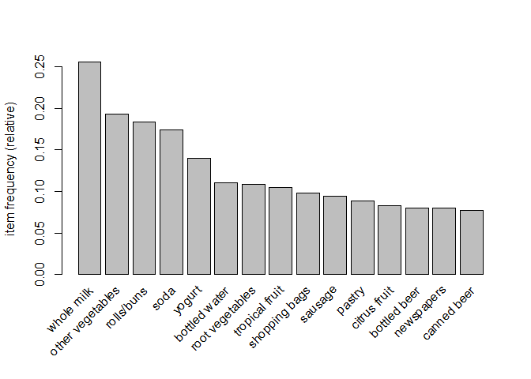<!-- -->

The final thresholds we selected were support=.005, confidence=.2, and
maxlen=5. These were selected by trying out various combinations of the
three and inspecting the results (code not included). We selected our
final thresholds due to the reasonable amount of rules produced (873)
compared to other combos that produced upwards of 1500 rules. Subsets of
873 rules also produced actionable insights for a
    grocer.

    ## To reduce overplotting, jitter is added! Use jitter = 0 to prevent jitter.

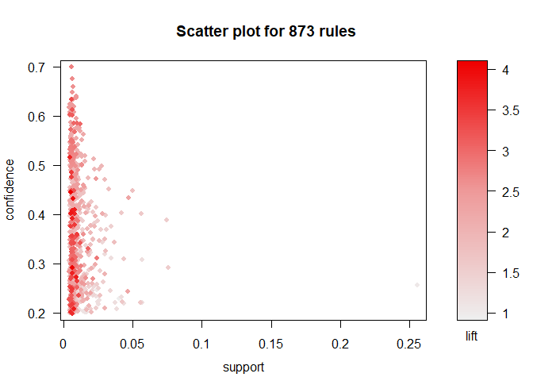<!-- -->

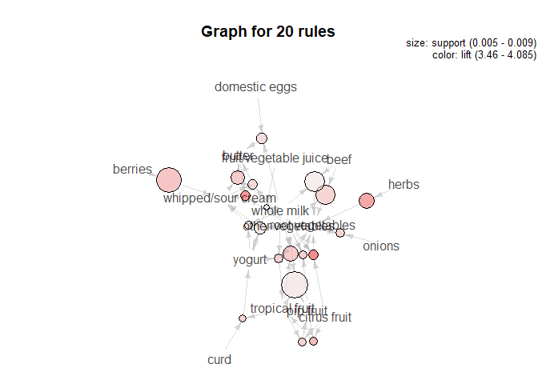<!-- -->

As expected, the most prominent rule emerging from the grocery baskets
was butter and yogurt -\> whole milk with a confidence of 64%. However,
in total there were 229 rules pointing to whole milk because it is such
a popular grocery item. In comparison, the 12 rules for sausage were
quite interesting. Pairings leading to sausage with confidence around
20% included root vegetables and yogurt, other vegetables and shopping
bags, and soda and yogurt. These items are pretty unintuitive when it
comes to sausage trends. In addition, it was surprising to see that
hamburger meat was not largely intertwined in the network.

The graph output from gephi shows the network of grocery items with
nodes with degree less than 3 filtered out. The nodes and edges are
partitioned (and colored) by confidence.

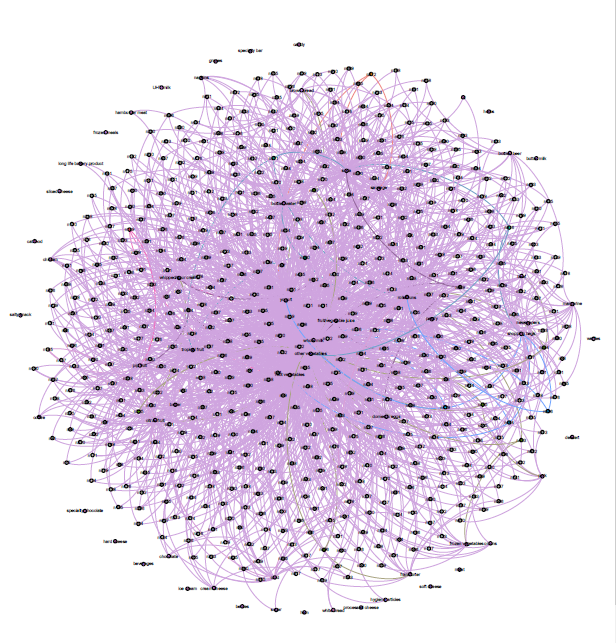<!-- -->
