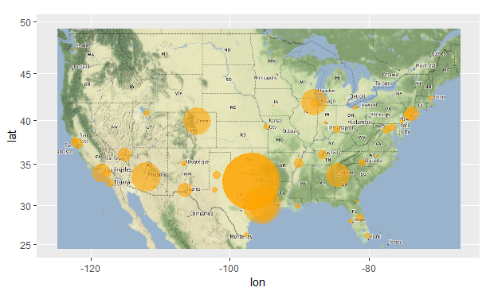
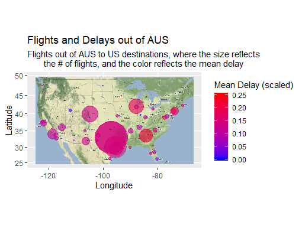

```{r setup, include=FALSE}
knitr::opts_chunk$set(echo = TRUE)
```
#STA 380: Predictive Modeling II Case Studies

## By: Rachel Meade, Ian Hatfield, Curtis Krawczyk, LaShay Fontenot

```{r}
rm(list=ls())
library(mosaic)
library(dplyr)


```

## Green Buildings

Real estate investors and developers invest in green buildings, whether they are LEED- or EnergyStar-certified with the hopes of being able to generate additional revenues in rent, or (in cases in which utilities are not reimbursed by tenants) to save enough money in utilities to effectively generate higher profits by reducing utility expenses. Although these hopes may be realized in individual cases, there is not enough support in the Green Buildings dataset to conclude that investing in a Green Building will typically generate higher rents or utilities savings. In fact, based on some simple analysis, it appears that some green buildings may even generate lower rents than similar non-green buildings. 

The previous analysis provided in the case study was flawed because it looked only at green versus non-green buildings in aggregate. It concluded that green buildings generated higher rents by comparing median price per square foot of green and non-green buildings. This analysis does not look at many other potential hidden variables that could account for the difference in price, other than green vs. non-green. 

The graph below demonstrates that proportionally more green buildings are Class A than non-green buildings. 
```{r}
#loading in the data
green = read.csv('./data/greenbuildings.csv')
summary(green)

#Cleaning low occupancy buildings
green_clean = subset(green, leasing_rate > 10)

#Separating data into green/non-green buildings
green_only = subset(green_clean, green_rating==1)
non_green = subset(green_clean, green_rating == 0) 


```

```{r}
#Summary of green buildings
summary(green_only)

```
```{r}
#Summary of non-green buildings
summary(non_green)

```

```{r}
#Further separating into different class buildings for green buildings
Aclass_green = subset(green_only, class_a == 1)
Bclass_green = subset(green_only, class_b == 1)
Cclass_green = subset(green_only, class_a == 0 & class_b == 0)

#non-green buildings
Aclass_ngreen = subset(non_green, class_a == 1)
Bclass_ngreen = subset(non_green, class_b == 1)
Cclass_ngreen = subset(non_green, class_a == 0 & class_b == 0)

#creating column for class type


class_type <- ifelse(green$class_a == 1, 'A', ifelse(green$class_b == 1, 'B', ifelse(green$class_a == 0 & green$class_b == 0, 'C', NA)))

green = cbind(green,class_type)


```
```{r, echo = FALSE}


rel_freq <- ggplot(green, aes(class_type, group = green_rating)) + 
          geom_bar(aes(y = ..prop..,fill = factor(..x..)), stat="count") + 
          scale_y_continuous(labels=scales::percent) +
          labs(x = 'Class Type',
          y = "Relative Frequencies",
          title = 'Relative Frequency of Class Types by Green/Non-green',
          caption="Source: greenbuilding data set in R") +
          facet_grid(~green_rating, labeller = label_both)
  
rel_freq

```
The percentage of Class A green buildings is ~79.8%.
The percentage of Class A non-green buildings is ~37%.
The percentage of Class B green buildings is ~19.15%.
The percentage of Class B non-green buildings is ~48.5%.
The percentage of Class C green buildings is ~1%.
The percentage of Class C non-green buildings is ~14.5%.

Green buildings could generate higher rents overall not because they are green, but because they are nicer buildings, on average. This analysis suggests that green buildings could generate higher rents on average because they are more likely to be Class A Buildings. 

When the effects of building class and green vs. non-green are separated, the conclusion that green buildings generate higher rents is unsupported. 

```{r, echo=FALSE}
green %>%
group_by(class_type, green_rating) %>%
summarise(AverageRent = mean(Rent)) %>%
 ggplot(aes(factor(class_type), AverageRent, label=round(AverageRent, 2), fill=factor(green_rating))) +
 geom_col(position = position_dodge(), color='black') +
 scale_fill_manual(values=c('red','dark green')) +
 geom_text(position=position_dodge(width = 0.9),vjust = -0.3) +
 labs(title="Bar plot",
      subtitle="Mean Rent by Class",
      caption="Source: greenbuilding data set in R",
      x="Class", y="Mean Rent ($USD/sq. ft)", fill="Green Rating")

```
The above graph demonstrates that when separated by class, only Class C green buildings generate higher rents than their non-green counterparts. This supports the conclusion that the effect captured in the previous report was actually related to having nicer buildings on average in the green population, compared to the non-green population. 

A multiple regression provides additional evidence to further separate the effects of Building Class and Green status. As demonstrated by the coefficients below, a Class A generates the greatest rent premiums, followed by Class B buildings. Green buildings actually have a negative relationship to price (although the statistical significance is less certain than building class). This would suggest that green buildings typically have lower rents than their non-green peers. 

```{r}
reg = lm(Rent~class_a+class_b+green_rating, green )
summary(reg)

```
This still leaves the question of lower utility expense. Based on a little external research, a typical office building utilizes about 17.3 kilowatt hours per square foot per year. At 2.9 cents per kilowatt hour, this is about 50 cents per square foot per year. Even if there was a 50% savings in electricity expenses, this would not outweigh the approximately two dollar difference in rent for Class A green vs. non-green buildings. Gas expense savings were similarly negligible. 

In conclusion, although there may still be moral and reputational benefits to investing in green properties, there is insufficient evidence to conclude that green buildings will result in better financial investment returns. Instead of investing in green certification, the developer may realize better returns by upgrading the building's class (e.g. from a Class B to a Class A building). 

#Fligths at Austin-Bergstrom Airport

```{r}
rm(list=ls())
library(tidyverse)
library(ggmap)
library(lubridate)
library(ggplot2)
library(data.table)
library(ggrepel)
library(dplyr)
library(scales)
```

```{r}
data = read.csv("./data/ABIA.csv")
codes = read.csv("./data/airport-codes.csv")
attach(data)
```

```{r}
#grab important info from codes file
codes_crop = codes[,10:12]
codes_crop = codes_crop[,c(1,3)]
codes_crop = distinct(codes_crop, codes_crop$iata_code,.keep_all=TRUE)
#merge for destination coords
data2 = merge(data,codes_crop,by.x=("Dest"),by.y=("iata_code"),all.x=TRUE)
data2 = data2[,-31]
names(data2)[30] = "dest_coord"
#merge for origin coords
data2 = merge(data2,codes_crop,by.x=("Origin"),by.y=("iata_code"),all.x=TRUE)
data2 = data2[,-32]
names(data2)[31] = "origin_coord"
#split coords into long and lat
data3 = separate(data2, dest_coord,c("dest_lat","dest_long"),
                 sep = ",",remove=FALSE)
data3 = separate(data3, origin_coord,c("origin_lat","origin_long"),
                 sep = ",",remove=FALSE)
```

The below plots are created by first subsetting the dataset to focus on flights departing from the Austin airport. These destinations are then plotted on a map of the US with the size of the marker reflecting the amount of flights to that location. Markers are then colored based on the average delay time of flights to those locations on a blue/red scale. This final plot could be helpful for Austinites that travel frequently and are curious about flight patterns for their destination.


```{r}
#Subset data to Austin departures
aus = data3[which(data3$Origin=="AUS"),]

#How many destinations from aus?
length(unique(aus$Dest)) #52 different locations

#Groupby locations and get count of flights
grouped = summarize(group_by(aus,Dest,dest_long,dest_lat),count=n())
grouped$count = as.numeric(grouped$count)
grouped$dest_long = as.numeric(as.character(grouped$dest_long))
grouped$dest_lat = as.numeric(as.character(grouped$dest_lat))
```

```{r, results= 'hide'}
#Plot USA map
usa_bb = c(-124.848974, 24.396308, -66.885444, 49.384358)
usa_map = ggmap(get_stamenmap(bbox=usa_bb, scale=2, zoom=5,
                              maptype = "terrain"), extent="normal")

#Layer AUS destinations with size as number of flights
#scale down circle sizes to fit on map
circle_scale_amt = 0.0035
#plot
usa_map + 
  geom_point(aes(x = dest_long, y = dest_lat),data=grouped, 
                          col= "orange",alpha=.6,size = grouped$count*circle_scale_amt)+
               scale_size_continuous(range=c(1,5573))
```
<!-- -->

```{r, results = 'hide'}
#get delays
grouped2 = summarize(group_by(aus,Dest,dest_long,dest_lat), count= n(),
                     delay = mean(ArrDelay, na.rm = T))
grouped2$count = as.numeric(grouped2$count)
grouped2$dest_long = as.numeric(as.character(grouped2$dest_long))
grouped2$dest_lat = as.numeric(as.character(grouped2$dest_lat))

#scale delay so that all positive values (for graphing purposes)
grouped2$scdelay = as.numeric(rescale(grouped2$delay))
grouped2 = grouped2[-39,]

#build plot, where darker = higher avg delays
usa_map + 
  geom_point(aes(x = dest_long, y = dest_lat,col= grouped2$scdelay),data=grouped2, 
             alpha=.6,size = grouped2$count*circle_scale_amt)+
  scale_size_continuous(range=c(1,5573))+
  scale_color_gradient(low="blue",high="red",limits=c(0,.25)) +
  labs(title = "Flights and Delays out of AUS", 
       subtitle = "Flights out of AUS to US destinations, where the size reflects
       the # of flights, and the color reflects the mean delay",
       x= "Longitude",y="Latitude",colour="Mean Delay (scaled)")
```
<!-- -->

In summary we see that flights from AUS to ATL are typically delayed longer than flights to other locations. On the other hand, flights to Miami are great (for more than one reason, I'd say). These results are not incredibly surprising because ATL is a huge airport hosting thousands of flights, and is more susceptible to regular and weather delays than Miami. In addition, it is not surprising that a majority of flights out of AUS are to Dallas and Houston - I would assume that this is largely due to business travel.


# Portfolio Modeling
We will construct four portfolios of exchange-traded funds (ETFs) and use bootstrap resampling to analyze the short-term tail risk of these portfolios. 

We will assume we have $100,000 in capital. We will construct portfolios using between 3 and 10 ETFs, with different weights. 

We will assume that the portfolios are rebalanced each day at zero transaction cost.

First, we prepare to run the Monte Carlo simulations by calling the necessary libraries, defining the ETFs we will use to build each portfolio, and import 5 years of historical returns that we will draw from in the simulations. 


```{r}
rm(list=ls())
library(mosaic)
library(quantmod)
library(foreach)

mystocks = c("EUSA", "VUG", "PGX", "MDIV", "USCI", "SPLV", "XLK", "BND", "KNOW", "SPY")
myprices = getSymbols(mystocks, from = "2014-08-15")

```
Adjust all ETFs and create a new object adding 'a' to the end.

```{r}
for(ticker in mystocks) {
  expr = paste0(ticker, "a = adjustOHLC(", ticker, ")")
  eval(parse(text=expr))
}
```
Combine all the returns in a matrix.
```{r}
all_returns = cbind(	ClCl(EUSAa),
                     ClCl(VUGa),
                     ClCl(PGXa),
                     ClCl(MDIVa),
                     ClCl(USCIa),
                     ClCl(SPLVa),
                     ClCl(XLKa),
                     ClCl(BNDa),
                     ClCl(KNOWa),
                     ClCl(SPYa))

all_returns = as.matrix(na.omit(all_returns))
```
Compute the returns from the closing prices
```{r}
pairs(all_returns)
```
Run the Monte Carlo simulations to demonstrate many different possible scenarios. 
```{r}
initial_wealth = 100000
sim1 = foreach(i=1:5000, .combine='rbind') %do% {
  total_wealth = initial_wealth
  weights = c(0.1, 0.1, 0.1, 0.1, 0.1, 0.1, 0.1, 0.1, 0.1, 0.1)
  holdings = weights * total_wealth
  n_days = 20
  wealthtracker = rep(0, n_days)
  for(today in 1:n_days) {
    return.today = resample(all_returns, 1, orig.ids=FALSE)
    holdings = holdings + holdings*return.today
    total_wealth = sum(holdings)
    wealthtracker[today] = total_wealth
  }
  wealthtracker
}
```
Histogram of the ending wealth amounts generated by the simulations.
```{r}
hist(sim1[,n_days], 25)
```
Profit/loss
```{r}
mean(sim1[,n_days])
hist(sim1[,n_days]- initial_wealth, breaks=30)
```
Calculate Value at Risk at the 5% level.
```{r}
temp = sim1[,n_days]- initial_wealth
quantile(temp,p=0.05)
```

We repeat the above process twice more with different portfolios. Since we are using a subset of the same ETFs as the first example, we will just adjust the weights of each ETF and re-run the simulations. 
```
```
This portfolio focuses on the Tech Sector (30% weight on XLK - Technology Select Secotr SPDR Fund) and drop COmmodity Index Fund (USCI) & Bonds (BND). 

```{r}
initial_wealth = 100000
sim1 = foreach(i=1:5000, .combine='rbind') %do% {
  total_wealth = initial_wealth
  weights = c(0.1, 0.1, 0.1, 0.1, 0, 0.1, 0.3, 0, 0.1, 0.1)
  holdings = weights * total_wealth
  n_days = 20
  wealthtracker = rep(0, n_days)
  for(today in 1:n_days) {
    return.today = resample(all_returns, 1, orig.ids=FALSE)
    holdings = holdings + holdings*return.today
    total_wealth = sum(holdings)
    wealthtracker[today] = total_wealth
  }
  wealthtracker
}

hist(sim1[,n_days], 25)
```
Profit/loss
```{r}
mean(sim1[,n_days])
hist(sim1[,n_days]- initial_wealth, breaks=30)
```
5% Value at Risk
```{r}
temp = sim1[,n_days]- initial_wealth
quantile(temp,p=0.05)
```

Change weights to focus on Bonds, & Commodity Index and drop EUSA, VUG, SPY, XLK, and PGX
```{r}
initial_wealth = 100000
sim1 = foreach(i=1:5000, .combine='rbind') %do% {
  total_wealth = initial_wealth
  weights = c(0, 0, 0.1, 0, 0.35, 0.1, 0, 0.35, 0.1, 0)
  holdings = weights * total_wealth
  n_days = 20
  wealthtracker = rep(0, n_days)
  for(today in 1:n_days) {
    return.today = resample(all_returns, 1, orig.ids=FALSE)
    holdings = holdings + holdings*return.today
    total_wealth = sum(holdings)
    wealthtracker[today] = total_wealth
  }
  wealthtracker
}

hist(sim1[,n_days], 25)
```
Profit/loss
```{r}
mean(sim1[,n_days])
hist(sim1[,n_days]- initial_wealth, breaks=30)
```
5% Value at Risk
```{r}
temp = sim1[,n_days]- initial_wealth
quantile(temp,p=0.05)
```

Finally, we try to make a poorly diversified portfolio, leaving only Commodities, Tech, and Insider Sentiment. 
```{r}
initial_wealth = 100000
sim1 = foreach(i=1:5000, .combine='rbind') %do% {
  total_wealth = initial_wealth
  weights = c(0, 0, 0, 0, 0.4, 0, 0.4, 0, 0.2, 0)
  holdings = weights * total_wealth
  n_days = 20
  wealthtracker = rep(0, n_days)
  for(today in 1:n_days) {
    return.today = resample(all_returns, 1, orig.ids=FALSE)
    holdings = holdings + holdings*return.today
    total_wealth = sum(holdings)
    wealthtracker[today] = total_wealth
  }
  wealthtracker
}

hist(sim1[,n_days], 25)
```
Profit/loss
```{r}
mean(sim1[,n_days])
hist(sim1[,n_days]- initial_wealth, breaks=30)
```
5% Value at Risk
```{r}
temp = sim1[,n_days]- initial_wealth
quantile(temp,p=0.05)
```
The first portfolio is the most diversified, which would suggest that it would have a better sharpe ratio than some of the other portfolios we constructed. We would expect it to have good returns compared to the amount of value at risk. After running the Monte Carlo simulations, the outcome matched expectations. 

The second portfolio is more aggressive. It emphasizes the technology sector, but it is still fairly diversified. Because it retains some diversification and emphasizes an industry that has been strong in the past few years, we would expect slightly higher returns than the highly diverse portfolio above, but at the expense of greater value at risk. Again, the simulations confirmed our expectations. 

The third portfolio was intended to be low risk. 70% of the wealth is invested in bonds and commodities, and includes smaller amounts of preffered equities, the low volatility S&P index, and insider sentiment. As expected, this portfolio generated the lowest returns on average, and had the lowest value at risk. 

Finally, we attempted to construct a portfolio that was poorly diversified, and therefore higher risk. It invests 40% in Commodities, 40% in Tech, and the remaining 20% in Insider Sentiment. As suspected, it had the highest value at risk, but surprisingly, it was only slightly higher than the technology portfolio. On average, it generated lower returns than the technology portfolio. Therefore, as suspected, this portfolio would likely be a poor investment choice. 

It is important to note, however, that all of these results could be impacted by only using the past five years' history to draw from in the Monte Carlo simulations. In the past five years (2014-2019), the market has generally been bullish and market returns have been generally positive. With uncertainty in the market growing and rumors of an impending recession, the past five years of returns are not necessarily indicative of the most probable future outcomes. 


#Market Segmentation

```{r}
rm(list=ls())
df <- read.csv(file=".\\data\\social_marketing.csv", header=TRUE, sep=",")
library(ggplot2)
library(dplyr)
library(purrr)
library(factoextra)
df=df[,-1]
```

In order to use k-means clustering on the twitter followers a value of k needs to be chosen. The elbow plot below is somewhat ambiguous as to where the elbow is, but a value of 7 was chosen for k.  

```{r}
set.seed(123)

# function to compute total within-cluster sum of square 
wss <- function(k) {
  kmeans(df, k, nstart = 15 )$tot.withinss
}

# Compute and plot wss for k = 1 to k = 15
k.values <- 1:15

# extract wss for 2-15 clusters
wss_values <- map_dbl(k.values, wss)

plot(k.values, wss_values,
       type="b", pch = 19, frame = FALSE, 
       xlab="Number of clusters K",
       ylab="Total within-clusters sum of squares")
```
```{r}
set.seed(123)
final <- kmeans(df, 7, nstart = 25)
```


```{r}
cluster=df %>%
  mutate(Cluster = final$cluster) %>%
  group_by(Cluster) %>%
  summarise_all("mean")

cluster
```

__Below we will examine the 7 customer segments that were identified using k-means clustering:__  

__Customer segment 1, Politics:__  
Looking at the mean values of customer segment 1 the categories that stand out are Travel, Politics, and News. These categories depict a customer base of individuals who follow world events and travel. 


__Customer segment 2, Fashion:__  
Looking at the mean values of customer segment 2 the categories that stand out are Photo Sharing, Music, Cooking, Beauty, and Fashion. These categories depict a customer base of individuals interested in fashion/beauty.


__Customer segment 3, Family:__  
Looking at the mean values of customer segment 3 the categories that stand out are Sports Fandom, Food, Religion, Family and Parenting. These categories depict a customer base of parents and family oriented individuals.


__Customer segment 4, Health Conscious:__  
Looking at the mean values of customer segment 4 the categories that stand out are Food, Health, Cooking, Outdoors, and Fitness. These categories depict a customer base of health conscious individuals.  


__Customer segment 5, College Students/Young Adults:__  
Looking at the mean values of customer segment 5 the categories that stand out are tv/Film, online gaming, College/Uni, and Sports Playing. These categories depict a customer base of college students/young adults.


__Customer segment 6, N/A:__  
Looking at the mean values of customer segment 6 no categories standout. This is a very uninterpretable customer segment and it is possible that this segment is a collection of customers from many segments. For every value of K, there was an uninterpretable segment.  


__Customer segment 7, Pop Culture:__  
Looking at the mean values of customer segment 7 the categories that stand out are Chatter, Current Events, Photo Sharing, and Shopping. These categories depict a customer base of pop culture influenced individuals.

#Author Attribution

To start the analysis of author attribution we created readerPlain, this wraps another function around readPlain to read plain text documents in English. Using readerPlain, the train .txt files and test .txt files are read in and stored in corresponding large lists. Making the large lists vectors, two separate corpora are made, one for train and one for test. Next is pre-processing, the pre-processing/tokenization steps are as follows, make everything lower case, remove numbers, remove punctuation, remove excess white-space, and remove stop words, 'en'. Having processed both corpus', document term matrices were created and words that appeared in <90% of documents were removed. Using the DTMs, TFIDF matrices were created and saved as train and test. The TFIDF matrices were converted to data frames and an empty author column was created, the author column was then populated using a for loop that assigned a unique author id to each document. The author columns were then changed to be type 'factor'. At this point, the pre-model processing has been completed and we now will prepare the data for a naive bayes model. A X train matrix and X test matrix were created using all predictors from the corresponding matrices and a y train and Y test list were created from the author columns of the corresponding matrices. There are columns in X train that do not appear in X test, these columns were ignored. A naive bayes model was then fit using X train and the model was used to predict X test. The results were then put into a confusion matrix where the accuracy of the model was seen to be 36%.  


```{r}
rm(list=ls())
library(tm) 
library(caret)
library(magrittr)
library(slam)
library(proxy)
library(stringr)
library(randomForest)
library(naivebayes)

readerPlain = function(fname){
  readPlain(elem=list(content=readLines(fname)), 
            id=fname, language='en') }


```


```{r}
setwd("./data/ReutersC50/C50train")
file.list = dir(path = ".", pattern = "\\.txt$", full.names = TRUE, recursive = TRUE)
trainFiles = lapply(file.list, readerPlain) 


```

```{r}
setwd("./data/ReutersC50/C50test")
file.list1 = dir(path = ".", pattern = "\\.txt$", full.names = TRUE, recursive = TRUE)
testFiles = lapply(file.list1, readerPlain) 

```
```{r}
## once you have documents in a vector, you 
## create a text mining 'corpus' with: 
documents_raw = Corpus(VectorSource(trainFiles))

## Some pre-processing/tokenization steps.
## tm_map just maps some function to every document in the corpus
my_documents = documents_raw
my_documents = tm_map(my_documents, content_transformer(tolower)) # make everything lowercase
my_documents = tm_map(my_documents, content_transformer(removeNumbers)) # remove numbers
my_documents = tm_map(my_documents, content_transformer(removePunctuation)) # remove punctuation
my_documents = tm_map(my_documents, content_transformer(stripWhitespace)) ## remove excess white-space

## Remove stopwords.  Always be careful with this: one person's trash is another one's treasure.
my_documents = tm_map(my_documents, content_transformer(removeWords), stopwords("en"))


## create a doc-term-matrix
DTM_train = DocumentTermMatrix(my_documents)
DTM_train = removeSparseTerms(DTM_train, 0.95)
tfidf_train = weightTfIdf(DTM_train)
train = as.matrix(tfidf_train)
```

```{r}
## once you have documents in a vector, you 
## create a text mining 'corpus' with: 
documents_raw1 = Corpus(VectorSource(testFiles))

## Some pre-processing/tokenization steps.
## tm_map just maps some function to every document in the corpus
my_documents1 = documents_raw1
my_documents1 = tm_map(my_documents1, content_transformer(tolower)) # make everything lowercase
my_documents1 = tm_map(my_documents1, content_transformer(removeNumbers)) # remove numbers
my_documents1 = tm_map(my_documents1, content_transformer(removePunctuation)) # remove punctuation
my_documents1 = tm_map(my_documents1, content_transformer(stripWhitespace)) ## remove excess white-space

## Remove stopwords.  Always be careful with this: one person's trash is another one's treasure.
my_documents1 = tm_map(my_documents1, content_transformer(removeWords), stopwords("en"))


## create a doc-term-matrix
DTM_test = DocumentTermMatrix(my_documents1)
DTM_test = removeSparseTerms(DTM_test, 0.95)
tfidf_test = weightTfIdf(DTM_test)
test = as.matrix(tfidf_test)

```

```{r}
#make train and test dfs 
train = as.data.frame(train)
test = as.data.frame(test)
```

```{r}
#add author id to author columns in test and train. change the column to a factor for classification

 for (i in 1:50) {
      author_start = 50*(i-1) + 1
      author_last = (50*i)
      
      train$author[author_start:author_last] = i
      test$author[author_start:author_last] = i
    }

train$author = as.factor(train$author)
test$author = as.factor(test$author)
```

```{r}
#create train and test matricies.

X_Train = as.matrix(train[,names(train)!='author'])
Y_Train = as.factor(train$author)
X_Test = as.matrix(test[,names(test)!='author'])
Y_Test = test$author
```
```{r}
naive.fit = naive_bayes(X_Train,Y_Train)

```
```{r}
naive_predict=predict(naive.fit,X_Test,type='class')
```
```{r}
##Confusion matrix to check accuracy
xtab = table(naive_predict,Y_Test)
confusionMatrix(xtab)
```


#Association Rules

```{r}
rm(list=ls())
library(tidyverse)
library(arules)
library(arulesViz)
```

```{r}
#Read in data as transactions class
groc = read.transactions(".\\data\\groceries.txt", format="basket", sep= ",")
summary(groc)
#plot item frequency dist
itemFrequencyPlot(groc, topN = 15)
```

The final thresholds we selected were support=.005, confidence=.2, and maxlen=5. These were selected by trying out various combinations of the three and inspecting the results (code not included). We selected our final thresholds due to the reasonable amount of rules produced (873) compared to other combos that produced upwards of 1500 rules. Subsets of 873 rules also produced actionable insights for a grocer. 
```{r}
rules_three = apriori(groc, parameter=list(support=.005, confidence=.2, maxlen=5))
summary(rules_three)
cat("Number of Rules",length(rules_three)) #873 rules
inspect(subset(rules_three, subset=lift > 3)) #65 rules; good variety
inspect(subset(rules_three, subset=confidence > 0.5)) #100ish rules
inspect(subset(rules_three, confidence > 0.3 & lift >3)) #39 rules; root vegetables
```

```{r}
plot(rules_three)
```

```{r}
plot(head(rules_three, 20, by='lift'), method='graph')
```

```{r}
milkrules <- subset(rules_three, rhs %pin% "whole milk")
inspect(milkrules) #229 rules

tropfruitrules <- subset(rules_three, rhs %pin% "tropical fruit")
inspect(tropfruitrules) #52 rules

sausagerules <- subset(rules_three, rhs %pin% "sausage")
inspect(sausagerules) #12 rules - odd rules
```

As expected, the most prominent rule emerging from the grocery baskets was butter and yogurt -> whole milk with a confidence of 64%. However, in total there were 229 rules pointing to whole milk because it is such a popular grocery item. In comparison, the 12 rules for sausage were quite interesting. Pairings leading to sausage with confidence around 20% included root vegetables and yogurt, other vegetables and shopping bags, and soda and yogurt. These items are pretty unintuitive when it comes to sausage trends. In addition, it was surprising to see that hamburger meat was not largely intertwined in the network. 

```{r}
saveAsGraph(head(rules_three, n = 1000, by = "lift"), file = "groceryrules_three.graphml")
```

The graph output from gephi shows the network of grocery items with nodes with degree less than 3 filtered out. The nodes and edges are partitioned (and colored) by confidence.

<!-- -->

